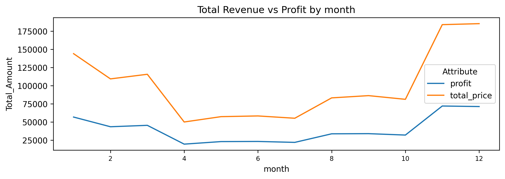
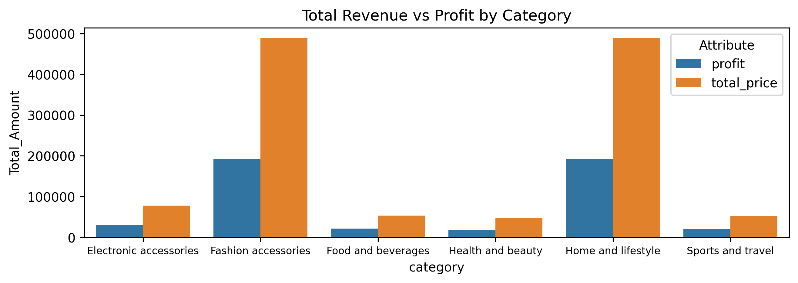
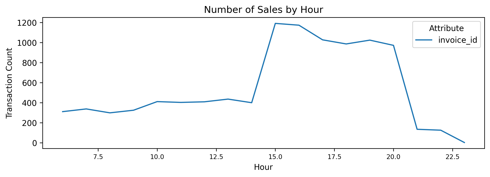
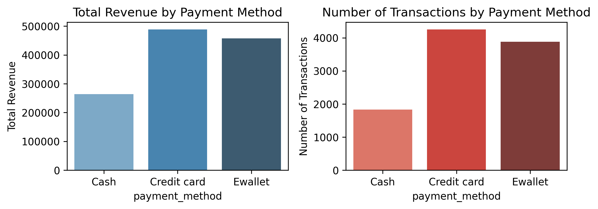

# 🛒 Walmart Sales & Interactive Analytics

This project analyzes Walmart retail sales data containing **9,969 transactions** across 5 years using **SQL for advanced business intelligence** and **Python (Streamlit)** for interactive dashboarding and exploratory data analysis.

The goal is to transform raw transactional data into **actionable business insights** related to financial performance, operational efficiency, and customer behavior.

---

# 📊 Visual Showcase: Key Insights

## 1. Macro Trend: Revenue vs. Profit Growth



**💡 Insight:**
A near-perfect correlation (**0.9487**) between revenue and profit indicates highly stable margins. A **recurring spike every January 12th** suggests a strong annual promotional event.

---

## 2. Category Efficiency: The Core Engines



**💡 Insight:**
**Fashion Accessories** and **Home & Lifestyle** generate nearly **$1M** combined revenue and act as the **primary volume drivers** of the business.

---

## 3. Operations: Peak Traffic Windows



**💡 Insight:**
Traffic surges after 11:00 AM, peaking at **15:00 (3 PM)** — the most critical staffing window.

---

## 4. Customer Behavior: Payment Preferences



**💡 Insight:**
**Credit Cards generate the highest revenue ($488K)**, indicating use for high-value purchases.

---

# 📌 Business Objectives

### Sales & Financials

* Revenue trends over time
* Profit vs revenue drivers
* Impact of **Quantity vs Unit Price**

### Operations

* Peak shopping hours
* Best-performing days

### Customer & Product Insights

* Customer satisfaction (ratings)
* Average Transaction Value (ATV)
* Category efficiency

---

# 🗄️ Data Structure

| Column         | Description           |
| -------------- | --------------------- |
| invoice_id     | Unique transaction ID |
| branch         | Store branch          |
| city           | Store city            |
| category       | Product category      |
| unit_price     | Price per unit        |
| quantity       | Units sold            |
| date           | Transaction date      |
| time           | Transaction time      |
| payment_method | Payment type          |
| rating         | Customer rating       |
| profit_margin  | Profit percentage     |
| total_price    | Revenue               |
| profit         | Net profit            |

---

# 📈 Executive Summary

### 💰 Financial Performance

* **Revenue:** $1,209,726
* **Profit:** $476,139
* **Correlation:** **0.9487**

### 🔥 Key Drivers

* Quantity drives profit (**0.7565**)
* Business is **volume-based**

---

# 🧠 SQL Analytics (Key Insights)

### 🌍 Geographic Insights

* 98 Cities | 100 Branches
* Multi-branch cities: **Weslaco, Waxahachie**

### 🏆 Top Cities

Weslaco, Waxahachie, Plano, San Antonio, Port Arthur

### 🏪 Top Branches

WALM009, WALM074, WALM003, WALM058, WALM030

### 📦 Category Volume

Fashion & Home dominate (≈9,600 units each)

### 💳 Payment Insights

* Credit Card → highest revenue ($488K)
* E-wallet → high frequency
* Cash → lowest

---

# 🧮 SQL Queries Used

(See project `.sql` file for full queries)

---

# 🛠️ Technologies Used

* SQL (SQL Server)
* Python (Pandas)
* Streamlit
* Seaborn & Matplotlib

---

# 🚀 How to Run

```bash
git clone https://github.com/BinEmad7/WalmartSales.git
cd WalmartSales
pip install pandas seaborn matplotlib streamlit
streamlit run app.py
```

---

# 👤 Author

Ahmed Alsharif
